# ProjeManag

### Android application for project management, which allows you to create boards, cards and add users to them

## Used technologies and tools

- Kotlin
- Android SDK
- Android XML
- RecyclerView
- View binding
- Firebase
- OkHttp

*This project was developed as part of The Complete Android 14 & Kotlin Development Masterclass by TutorialsEU*

*Minimum supported Android version is **Android 7 (Nougat)** but recommended is **Android 13 (Tiramisu)***

*To make the push-notification function work, you need to run the server, which is located in the root of the project*

## Illustrations

### Start screen

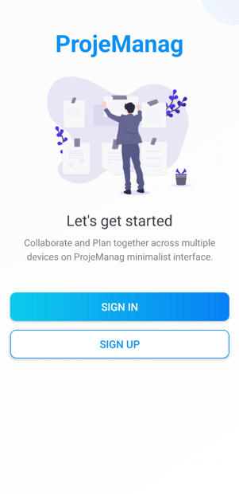

### Sign In screen

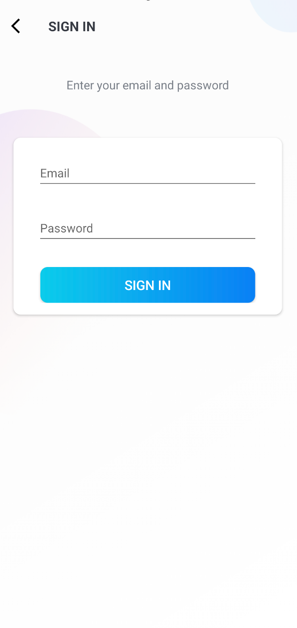

### Sign Up screen

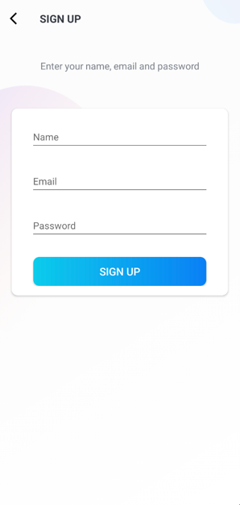

### Home screen

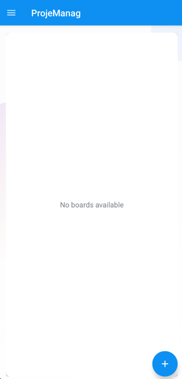

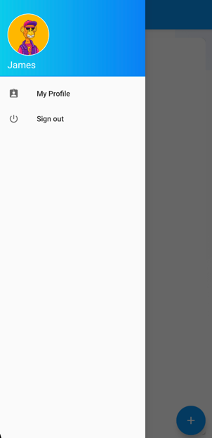

### Profile editing

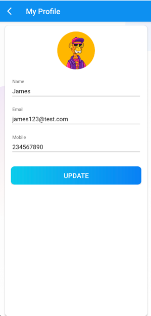

### Creating new Board

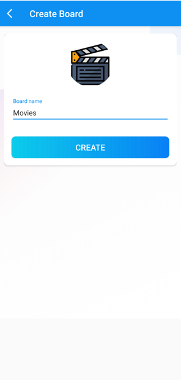

### Board screen with already added cards

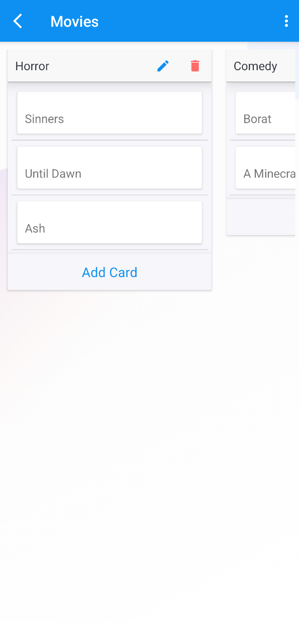

### Board members

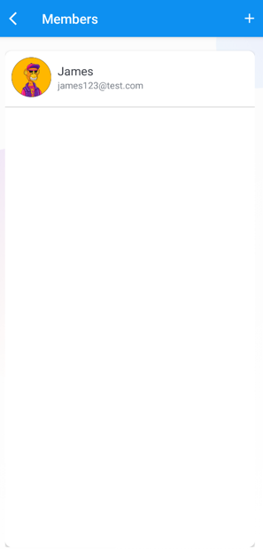

### Card details

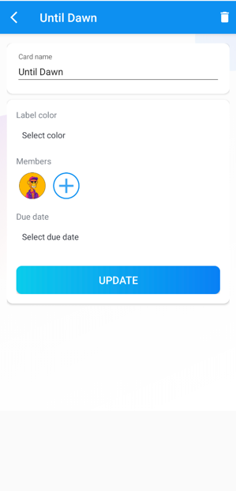

### Push-notification after adding to a new Board by another user

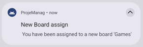